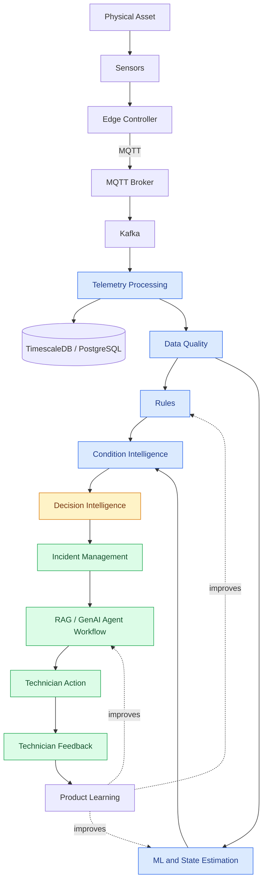
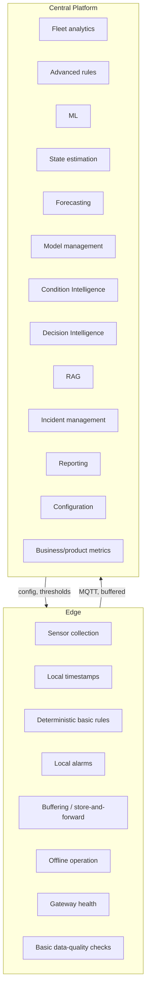
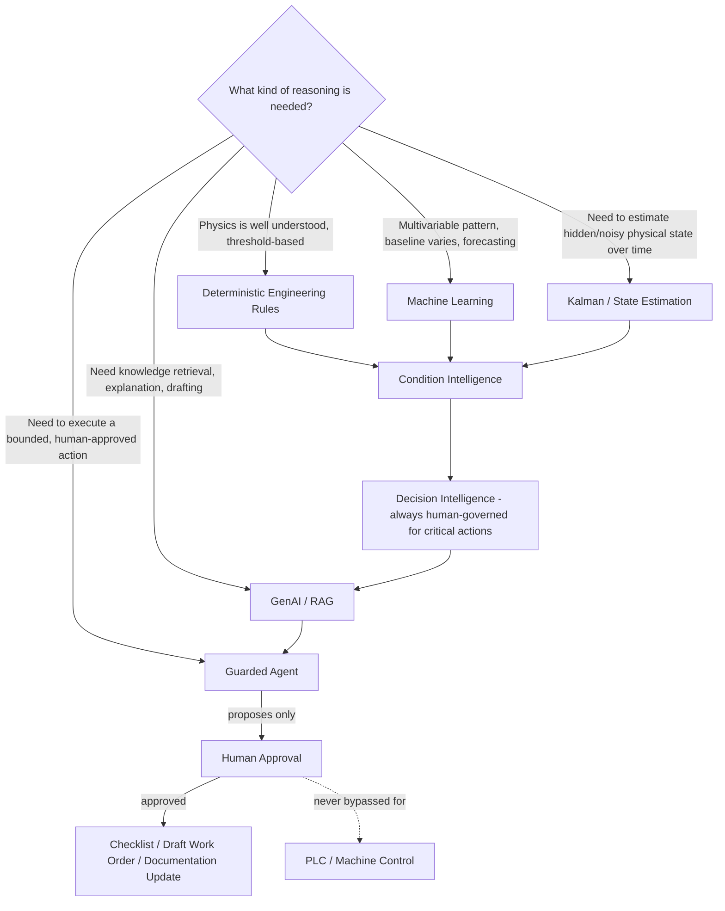
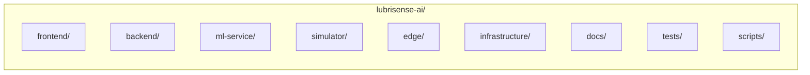

# LubriSense AI — Architecture

Status: PHASE 0 — DRAFT FOR ACCEPTANCE
Last updated: 2026-08-17

This document defines the end-to-end system architecture: how a physical signal becomes a
technician action and how that action becomes product learning, the responsibilities split
between edge and central platform, the boundaries between deterministic rules / ML / state
estimation / GenAI, the repository layout, security/safety boundaries, and what in this
reference implementation is synthetic versus what would require real industrial integration.

See also: `docs/PRODUCT_VISION.md` (why), `docs/DOMAIN_MODEL.md` (personas, physical model,
asset hierarchy), `docs/EVENT_CATALOG.md` (telemetry/event schemas),
`docs/FAILURE_MODE_CATALOG.md` (failure modes), `TECHNICAL_DECISIONS.md` (ADRs referenced
throughout).

---

## 1. End-to-End System Architecture



This single chain is the spine of the product. Every phase of implementation
(`IMPLEMENTATION_STATUS.md`) exists to make one more segment of this chain real. A feature that
does not sit somewhere on this chain, or that does not strengthen it, is out of scope.

### 1.1 Stage Responsibilities

| Stage | Responsibility | Layer |
|---|---|---|
| Physical Asset | The machine/bearing/lubrication system being observed. | — |
| Sensors | Physical or simulated measurement devices. | — |
| Edge Controller | Local collection, timestamping, buffering, deterministic local alarms. | Edge |
| MQTT | Lightweight device/gateway transport from edge to platform ingestion. | Edge → Platform boundary |
| Kafka | Scalable internal event streaming/backbone for platform consumers. | Platform |
| Telemetry Processing | Validation, normalization, deduplication, enrichment with asset context. | Platform |
| TimescaleDB/PostgreSQL | Durable storage: time-series telemetry + relational domain data. | Platform |
| Data Quality | Completeness, plausibility, staleness, sensor-health scoring. | Machine & Sensor Intelligence |
| Rules | Deterministic threshold/state logic where physics is well understood. | Machine & Sensor Intelligence |
| ML and State Estimation | Anomaly detection, classification, forecasting, Kalman/state estimation. | Machine & Sensor Intelligence |
| Condition Intelligence | Combines rules + ML + baselines + context into a structured `ConditionAssessment`. | Machine & Sensor Intelligence |
| Decision Intelligence | Combines condition + asset criticality + history + uncertainty into a `Decision`. | Decision Intelligence |
| Incident Management | Correlates decisions into trackable incidents with lifecycle. | Decision Intelligence → Workflow boundary |
| RAG / GenAI Agent Workflow | Retrieves approved knowledge, drafts checklists/work orders, explains evidence. | Workflow Intelligence |
| Technician Action | Human inspects, records findings/actions, resolves. | Workflow Intelligence (human-executed) |
| Technician Feedback | Outcome classification stored as labeled data. | Workflow Intelligence → Learning boundary |
| Product Learning | Feeds candidate training data / rule tuning back into upstream layers (governed, not automatic). | Cross-cutting |

---

## 2. Physical Lubrication-System Model

See `docs/DOMAIN_MODEL.md` §2 for the full component chain (Reservoir → Pump → Controller → Main
Lubrication Line → Distributor → Circuit → Lubrication Point → Bearing → Machine) and signal
categories. Architecturally, this model matters because:

- Every `TelemetrySource` implementation must emit readings scoped to a specific component in
  this chain, not an anonymous sensor ID (`TECHNICAL_DECISIONS.md` ADR-010).
- Rules and ML features are defined per component type (e.g., "pump current" rules differ from
  "bearing temperature" rules) — see `docs/EVENT_CATALOG.md` §2.
- The distinction between *lubrication-system signals* and *machine-condition signals* is what
  allows Decision Intelligence to reason about causal likelihood without overclaiming causality
  (`docs/FAILURE_MODE_CATALOG.md` §12).

---

## 3. Industrial Asset Hierarchy

See `docs/DOMAIN_MODEL.md` §3 for full definitions:

```
Tenant → Customer → Site → Plant → Production Line → Machine → Bearing
       → Lubrication System → Circuit → Lubrication Point → Sensor
```

Architecturally, this hierarchy is enforced, not advisory:

- Every telemetry ingestion path resolves and stamps the full asset context before persistence.
- Every API request is authorized against tenant scope before any query executes.
- The database schema uses foreign keys, not soft references, to prevent orphaned assets or
  cross-tenant relationships (`TECHNICAL_DECISIONS.md` ADR-010, `CLAUDE.md` "Data").

---

## 4. The Three Intelligence Layers — Architectural Boundaries

This is the architecture's central organizing principle (`TECHNICAL_DECISIONS.md` ADR-002).
Each layer is a distinct architectural boundary with its own failure mode, its own service
ownership, and its own allowed/forbidden operations.

```mermaid
flowchart LR
    subgraph MSI["Machine & Sensor Intelligence — WHAT IS HAPPENING?"]
        A1[Telemetry monitoring]
        A2[Sensor data quality]
        A3[Baselines]
        A4[Anomaly detection]
        A5[Failure classification]
        A6[Refill forecasting]
        A7[Pump degradation detection]
        A8[State estimation - Kalman]
        A9[Trend analysis]
    end
    subgraph DI["Decision Intelligence — WHAT DOES IT MEAN, WHAT SHOULD WE DO?"]
        B1[Combine rules + ML + state estimate]
        B2[Asset criticality + history + operating context]
        B3[Produce condition, severity, confidence, evidence]
        B4[Produce recommendation, priority, risk if deferred]
    end
    subgraph WI["Workflow Intelligence — HOW DO WE ACT?"]
        C1[RAG over approved docs]
        C2[Similar incident retrieval]
        C3[Checklist generation]
        C4[Work order drafting]
        C5[Guarded agent tools]
    end
    MSI --> DI --> WI
```



### 4.1 Machine & Sensor Intelligence

- **Owns**: telemetry interpretation, sensor health, baselines, anomaly detection, failure-mode
  classification, forecasting, state estimation.
- **Produces**: `ConditionAssessment` objects (see `docs/EVENT_CATALOG.md` §3).
- **Composition**: deterministic rules (where physics is clear) + ML (where patterns are
  multivariable or thresholds create excessive false positives) + Kalman/state estimation
  (explicitly *not* automatically "AI" — it is model-based state estimation).
- **Must never**: emit a maintenance recommendation directly, or reason about business/criticality
  context — that belongs to Decision Intelligence.

### 4.2 Decision Intelligence

- **Owns**: turning technical evidence into a maintenance decision.
- **Consumes**: `ConditionAssessment`, asset criticality, maintenance history, operating state,
  failure-mode knowledge, uncertainty.
- **Produces**: `Decision` objects (recommended action, priority, recommended window, risk if
  deferred, human_review_required, evidence, confidence — see `docs/EVENT_CATALOG.md` §3).
- **Must never**: be replaced or bypassed by an LLM. A raw ML prediction must never become
  maintenance advice without passing through this layer (`CLAUDE.md` "Decision Intelligence").

### 4.3 Workflow Intelligence

- **Owns**: helping humans act on a decision.
- **Allowed**: explain diagnosis, retrieve relevant approved documentation, find similar past
  incidents, generate inspection checklists, draft work orders, summarize investigations,
  capture technician findings.
- **Forbidden, absolutely**: operate machinery, change pump state, modify lubrication quantity,
  override PLC, alter safety settings, automatically close critical incidents.
- **Must never**: replace Decision Intelligence's judgment — Workflow Intelligence assists
  execution of a decision that has already been made upstream, it does not make the decision.

### 4.4 Layer Independence and Degradation

Each layer must be independently deployable and independently degradable:

| If this fails | Then this must still work |
|---|---|
| ML / State estimation | Deterministic rules and basic monitoring continue (Machine & Sensor Intelligence degrades to rules-only). |
| LLM / RAG | Condition Intelligence and Decision Intelligence continue unaffected; workflow falls back to manual documentation lookup. |
| Cloud connectivity | Edge deterministic monitoring and local alarms continue. |
| Central platform (Kafka/DB) | Edge buffers telemetry (store-and-forward) until connectivity restores. |

See §7 for the full graceful-degradation model.

---

## 5. Edge vs. Central/Cloud Responsibilities



The dividing line: **the edge must be able to protect the asset and the technician with basic,
explainable, deterministic logic even with zero connectivity to the cloud.** Everything that
requires fleet-wide context, historical data, or a model too large/complex to run at the edge
belongs centrally. This split is proposed, not finalized, pending Phase 5 (Edge Controller) —
see `TECHNICAL_DECISIONS.md` ADR-005.

---

## 6. Telemetry and Event Model

Full schemas live in `docs/EVENT_CATALOG.md`. Architecturally:

- **MQTT** is used between sensors/edge and platform ingestion — lightweight, pub/sub, suited to
  constrained devices and intermittent connectivity.
- **Kafka** is used internally within the platform as the event backbone — suited to durable,
  replayable, high-throughput fan-out to multiple consumers (data quality, features, rules, ML,
  incident generation, analytics). See `TECHNICAL_DECISIONS.md` ADR-006.
- Telemetry is never mutated in place; corrections are represented as new events with
  provenance, preserving auditability.
- Every event, from raw telemetry to incident lifecycle transitions, is versioned and carries
  asset context, timestamp (device and ingestion time), and provenance (source: synthetic,
  edge-real, etc.).

Phase 6 (`docs/TELEMETRY_PIPELINE.md`) implements the concrete MQTT → Kafka → TimescaleDB
path this section describes: an MQTT-to-Kafka bridge with durable local buffering, a Kafka
consumer with idempotent batch persistence, and a TimescaleDB hypertable partitioned on
event time — superseding this section only in implementation detail.

---

## 7. Boundary Between Rules, ML, State Estimation, GenAI, and Guarded Agents

This is a safety-critical architectural boundary, not a style preference.



| Technique | Used for | Never used for |
|---|---|---|
| **Deterministic rules** | Conditions with clear physical thresholds/state logic (e.g., reservoir below configured minimum). | Multivariable pattern recognition where fixed thresholds cause excessive false alerts. |
| **Machine Learning** | Anomaly detection, failure classification, consumption/refill forecasting — where patterns are complex or baselines vary per asset. | Producing maintenance advice directly (must pass through Decision Intelligence); replacing rules where physics is already clear. |
| **Kalman / Extended Kalman Filter** | Estimating a physical state (e.g., true pressure/flow trend) from noisy/partial sensor data. This is model-based state estimation, not automatically "AI." | Standing in for classification or forecasting tasks better suited to ML. |
| **GenAI / RAG** | Knowledge retrieval grounded in approved documents, explaining diagnoses in plain language, finding similar incidents, generating checklists, drafting work orders. | Diagnosing physical condition, producing ConditionAssessment/Decision output, acting as the source of engineering truth. |
| **Guarded Agents** | Executing a small, explicit set of tool calls (e.g., "create draft work order," "attach retrieved procedure") that a human then reviews/approves. | Any operation that starts/stops machinery, changes pump state, modifies lubrication quantity, overrides a PLC, alters safety settings, or auto-closes a critical incident. |

**Absolute rule**: AI — of any kind, including guarded agents — never directly controls
machinery, never overrides a PLC, and never changes a lubrication parameter. Human approval is
mandatory for every operational action. Edge deterministic monitoring must continue during any
cloud/ML/GenAI failure. (`TECHNICAL_DECISIONS.md` ADR-004, ADR-005.)

RAG-specific rules:

- Only `APPROVED` documents (lifecycle: DRAFT → REVIEW → APPROVED → RETIRED) may be used for
  production-style answers.
- Every RAG answer must cite source document and section.
- If evidence is insufficient: respond "Insufficient approved documentation to answer reliably,"
  not a fabricated procedure.
- Retrieved documents are untrusted input; the system must be protected against prompt injection
  originating from retrieved content.

---

## 8. Condition Intelligence and Decision Intelligence — Structured Contracts

To keep the layer boundary real (not just conceptual), both layers communicate via structured,
persisted, versioned objects rather than ad hoc function returns.

**ConditionAssessment** (Machine & Sensor Intelligence output — see `docs/EVENT_CATALOG.md` §3.3):
condition, status, severity, confidence, trend, evidence, uncertainty, data_quality, rule_version,
model_version.

**Decision** (Decision Intelligence output — see `docs/EVENT_CATALOG.md` §3.4): recommended
action, priority, recommended window, risk if deferred, human_review_required, evidence,
confidence.

A model prediction must never directly become maintenance advice — it must pass through Decision
Intelligence, which adds asset criticality, maintenance history, operating state, and failure-mode
knowledge (`CLAUDE.md` "Decision Intelligence", `TECHNICAL_DECISIONS.md` ADR-002).

---

## 9. Security and Safety Boundaries

### 9.1 Safety (non-negotiable)

- AI must never directly control machinery.
- GenAI/agents must never override PLCs.
- GenAI/agents must never change lubrication parameters (interval, quantity, pressure setpoints).
- Human approval is mandatory for every operational action.
- Edge deterministic monitoring must continue during cloud/ML/GenAI failure.

### 9.2 Security architecture

- OIDC/OAuth2-compatible identity architecture; RBAC mapped to the personas in
  `docs/DOMAIN_MODEL.md` §1.
- Server-side authorization on every request — RBAC must never be enforced only in the frontend.
- Tenant isolation enforced at the data-access layer, not just the API layer.
- Secrets never stored in source control; secure secret handling required.
- API input validation at every boundary.
- Structured, immutable audit logs for identity, authorization, and configuration-changing
  events.
- Rate limiting and secure headers on public-facing endpoints.
- Trace/correlation IDs propagated end to end (edge → MQTT → Kafka → API → workflow) for
  incident forensics.

### 9.3 Threats considered

Sensor spoofing, gateway compromise, telemetry tampering, replay attacks, unauthorized API
access, cross-tenant access, prompt injection, RAG poisoning, model tampering, configuration
tampering.

### 9.4 Observability

Structured JSON logging, Prometheus, Grafana, OpenTelemetry. Tracked: API latency, ingestion
rate, event-processing latency, broker lag, DB errors, ML errors, model latency, RAG latency,
LLM failure, CMMS integration failure. Exposed: `/health`, `/ready`, `/metrics`.

---

## 10. Synthetic/Demo Components vs. Real Industrial Integration

This reference implementation uses synthetic data end-to-end while keeping every synthetic
component behind a replaceable interface (`TECHNICAL_DECISIONS.md` ADR-001).

| Area | In this reference implementation (synthetic/demo) | What real deployment would require |
|---|---|---|
| Sensors | Simulated readings generated by `simulator/`, following configurable synthetic physical models and failure-injection profiles. | Real sensors (vibration, temperature, pressure, level, current transducers, etc.), calibrated and installed per manufacturer spec. |
| Controllers | Simulated centralized-lubrication controller behavior (cycle logic, fault codes). | Real lubrication controller hardware/firmware integration. |
| PLC interfaces | Not implemented; explicitly out of scope — the platform only ever *reads* condition data, never writes to a PLC. | A real, carefully governed read path (and never a write path for AI) into plant PLC/SCADA systems, following the customer's OT security policy. |
| Protocols | `TelemetrySource` interface with a `SyntheticTelemetrySource` implementation; MQTT/Kafka used with synthetic payloads. | Real OPC UA / MQTT schemas matching actual device vendors, real broker security (mTLS, ACLs), real OT network segmentation. |
| Asset hierarchy | Configurable demo tenant/customer/site/plant/line/machine data, illustrative of a real deployment's shape. | Real plant asset hierarchy imported/synced from the customer's asset register (often via CMMS/ERP). |
| Thresholds & failure signatures | Explicitly labeled demo assumptions (`docs/DOMAIN_MODEL.md` §2.3), configurable, not derived from proprietary data. | Real, validated lubrication and vibration thresholds appropriate to the specific bearing, lubricant, and duty cycle — typically requiring engineering/reliability validation and possibly field trials. |
| CMMS | Interface/adapter boundary with a mock/demo implementation for work-order draft export. | Real integration with the customer's CMMS (e.g., SAP PM, Maximo, or similar), respecting their work-order schema and approval workflow. |
| IAM/SSO | OIDC/OAuth2-compatible architecture, demo identity provider for local development. | Integration with the customer's enterprise IdP (Entra ID, Okta, etc.), real SSO/SCIM provisioning. |
| Telemetry realism | Statistically plausible synthetic time series with injected failure modes (`docs/FAILURE_MODE_CATALOG.md`). | Real historical and live telemetry, with all the noise, gaps, and edge cases real plants produce. |
| Failure labels | Synthetically generated ground truth from the failure-injection engine (Phase 4). | Real technician-confirmed failure labels, collected over time through the feedback loop, subject to the label-noise realities of field data. |
| Cybersecurity validation | Reference-level security architecture (§9), not independently audited. | Formal penetration testing, OT security review, and customer-specific cybersecurity sign-off before any production connection to real plant systems. |

**Principle**: the architecture must allow every synthetic component in this list to be replaced
by its real counterpart without redesigning the platform — replacement happens behind the
existing interface/adapter boundary (e.g., swap `SyntheticTelemetrySource` for
`MQTTTelemetrySource`/`OPCUATelemetrySource`; swap the demo CMMS adapter for a real one).

---

## 11. Repository Architecture



| Directory | Purpose |
|---|---|
| `frontend/` | Next.js/React/TypeScript application. Renders product surfaces for all personas. No business logic; all production-visible values originate from backend APIs (`TECHNICAL_DECISIONS.md` ADR-008). |
| `backend/` | FastAPI/Python domain platform: identity/tenancy, asset management, telemetry ingestion API, data quality, baselines, rules, condition intelligence, decision intelligence, incidents, maintenance workflow, knowledge/RAG orchestration, model management, business metrics, integrations, audit, observability. Owns persistence and business logic. |
| `ml-service/` | Model training, evaluation, and inference for anomaly detection, failure classification, forecasting, and state estimation. Exposes inference to the backend rather than embedding model logic in API route handlers. |
| `simulator/` | Synthetic physical-asset and telemetry generation, including the failure-injection engine (`docs/FAILURE_MODE_CATALOG.md`). Implements `TelemetrySource` as `SyntheticTelemetrySource`. This is the stand-in for real sensors/controllers. |
| `edge/` | Edge controller reference implementation: local collection, deterministic alarms, buffering/store-and-forward, MQTT publishing. Represents what would run on real edge gateway hardware. |
| `infrastructure/` | Docker Compose / IaC / deployment configuration for local development and reference deployment (Postgres/TimescaleDB, pgvector, Redis, MQTT broker, Kafka, observability stack). |
| `docs/` | Product, architecture, domain, event, and failure-mode documentation (this set of files), plus future phase-specific documentation. |
| `tests/` | Cross-cutting and integration tests that span multiple services (in addition to per-service test suites colocated with each service). |
| `scripts/` | Developer and operational tooling: environment bootstrap, data seeding, migration helpers, demo scenario runners. |

---

## 12. Customer-Value and Business-Product Model

LubriSense AI is architected to produce real, backend-computed metrics for both customer value
and business/product performance — never frontend-fabricated numbers
(`TECHNICAL_DECISIONS.md` ADR-008).

### 12.1 Product/business metrics (vendor-facing)

| Metric | Definition |
|---|---|
| Connected assets | Count of machines/lubrication systems actively reporting telemetry within an SLA window. |
| Useful alert rate | Share of raised incidents that technicians confirm as meaningful (not false positives). |
| Warning lead time | Time between an actionable warning and the point the condition would otherwise have become critical/failed. |
| Technician action rate | Share of incidents that result in a recorded technician action (vs. ignored/expired). |
| Deployment effort | Time/cost to onboard a new site (asset modeling, sensor commissioning, integration). |
| Support burden | Volume/severity of support interactions per connected asset. |
| Customer expansion | Growth in connected assets/sites within an existing customer account. |
| Attach rate | Share of eligible lubrication systems within a customer's fleet actually onboarded. |
| Product adoption | Feature usage across personas (e.g., share of technicians completing guided checklists). |

### 12.2 Customer-value metrics (customer-facing)

| Metric | Definition |
|---|---|
| Refill planning | Forecasted reservoir depletion used to plan lubricant refills proactively instead of reactively. |
| Inspection effort reduced | Reduction in manual/blind inspection relative to condition-driven inspection. |
| Emergency interventions avoided | Estimated reduction in unplanned/emergency maintenance events. |
| Estimated maintenance value | Modeled value of avoided downtime/interventions attributable to earlier detection. |

**All simulated ROI and estimated-value figures must be explicitly labeled `DEMO / ESTIMATED
VALUE`** and must never be presented as proven customer savings (`CLAUDE.md` "Customer/Business
Thinking").

### 12.3 North Star Metric

> Percentage of meaningful lubrication issues detected with actionable lead time.

Computed from the incident/outcome event history defined in `docs/EVENT_CATALOG.md` §6, using
technician-confirmed `TRUE_POSITIVE` outcomes with sufficient warning lead time as the numerator
and all meaningful (technician-adjudicated, excluding `FALSE_POSITIVE`) issues as the
denominator. Configurable, not hardcoded to one lead-time threshold.

---

## 13. Phase 0 Acceptance Criteria

Phase 0 is accepted when all of the following are true:

1. `docs/PRODUCT_VISION.md`, `docs/ARCHITECTURE.md`, `docs/DOMAIN_MODEL.md`,
   `docs/EVENT_CATALOG.md`, and `docs/FAILURE_MODE_CATALOG.md` exist and are internally
   consistent with each other and with `CLAUDE.md`.
2. All seven personas are defined with goals, key questions, and primary surfaces.
3. The three intelligence layers are defined with explicit allowed/forbidden operations and
   degradation behavior, and are visually distinguished in at least one architecture diagram.
4. The physical lubrication-system model (Reservoir → ... → Machine) and the industrial asset
   hierarchy (Tenant → ... → Sensor) are both fully defined and cross-referenced.
5. The end-to-end architecture chain (Physical Asset → ... → Product Learning) is diagrammed and
   each stage's responsibility is documented.
6. Edge vs. central/cloud responsibilities are explicitly split.
7. The boundary between deterministic rules, ML, Kalman/state estimation, GenAI/RAG, and guarded
   agents is explicit, including what each is forbidden from doing.
8. An initial failure-mode catalog covering all 11 required modes exists with signatures and
   evidence language rules.
9. The maintenance workflow (Incident → ... → Store Feedback) is defined end to end.
10. The customer-value and business-product metric model is defined, with all synthetic ROI
    explicitly labeled as demo/estimated.
11. Security and safety boundaries are explicit, including the non-negotiable AI/PLC/human-approval
    rules.
12. Synthetic vs. real-industrial-integration components are explicitly enumerated.
13. Repository architecture purpose is defined for every top-level directory.
14. No proprietary industrial manufacturer specifications, thresholds, or internal architecture have been invented;
    every synthetic engineering value is explicitly labeled as a demo assumption.
15. `IMPLEMENTATION_STATUS.md` and `TECHNICAL_DECISIONS.md` are updated to reflect Phase 0
    completion and any new architectural decisions made while producing these documents.

---

## 14. Major Technical Risks and Assumptions

| Risk / Assumption | Impact if wrong | Mitigation |
|---|---|---|
| Synthetic telemetry may not be statistically realistic enough to validate ML approaches meaningfully. | ML metrics from Phase 11+ may not generalize to real plant data. | Explicitly label all model performance as "validated against synthetic data only"; keep feature/label pipeline swappable for real data later. |
| Kafka + MQTT + Timescale + pgvector + Redis is significant local-development infrastructure complexity. | Slower iteration, higher onboarding cost for contributors. | Docker Compose reference environment (Phase 1); revisit topology if resource usage is prohibitive (`TECHNICAL_DECISIONS.md` ADR-006/ADR-007 revisit conditions). |
| Deterministic rule thresholds are demo assumptions, not validated engineering values. | Could mislead a reader into thinking they are production-ready thresholds. | Explicit disclaimers throughout docs and, later, in-product; configuration-driven thresholds, never hardcoded as constants. |
| Causal language between lubrication faults and bearing/machine issues is easy to overstate. | Could produce false confidence in a maintenance recommendation. | Enforced evidence-language rules (`docs/FAILURE_MODE_CATALOG.md` §12); explicit "independent of lubrication" failure mode. |
| GenAI/RAG boundary discipline depends on consistent enforcement across the codebase, not just documentation. | A future contributor could accidentally let an agent perform a forbidden action. | Guarded-agent tool allowlist enforced in code (Phase 19), not just policy; human-approval gate as a hard architectural checkpoint, not a UI suggestion. |
| Tenant isolation must be correct from the first schema design, since retrofitting it is high-risk. | Cross-tenant data leakage. | Foreign-key-enforced hierarchy from Phase 2 onward; authorization checked server-side on every request. |
| Scaling telemetry storage/retention strategy is not yet decided. | Could become a cost/performance bottleneck as simulated fleet size grows. | Flagged as a pending Phase 0 decision in `TECHNICAL_DECISIONS.md`; revisit with real scale testing (Phase 33). |
| Business/value metrics could be perceived as inflated marketing rather than credible estimates. | Undermines the reference implementation's credibility. | Hard labeling convention (`DEMO / ESTIMATED VALUE`) enforced everywhere these numbers appear. |
| Model governance (ADR-009) requires discipline to keep feedback-driven retraining human-gated. | Silent model drift/promotion without review. | Explicit model-registry/versioning requirement (Phase 32 MLOps) before any retrain-and-promote path is built. |

These risks are tracked and expanded in `IMPLEMENTATION_STATUS.md` § Known Risks as
implementation proceeds.
