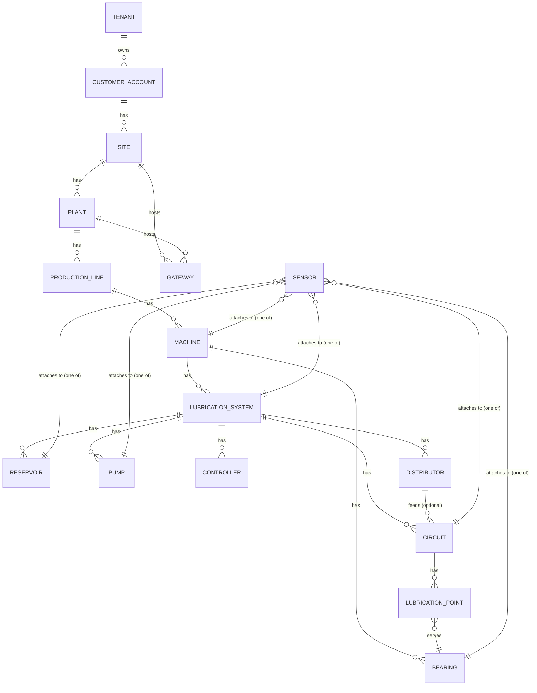

# Asset Hierarchy — Phase 2 Implementation

Status: PHASE 2 — DRAFT FOR ACCEPTANCE
Last updated: 2026-08-17

This document describes how the industrial domain model and asset hierarchy defined in
`docs/DOMAIN_MODEL.md` were actually implemented: entity relationships, the tenancy
mechanism, the sensor-attachment strategy, seed topology, and API usage. It supersedes
`docs/DOMAIN_MODEL.md` only in implementation detail — the conceptual hierarchy, physical
model, and personas defined there are unchanged.

---

## 1. Scope

Phase 2 implements the full asset hierarchy and physical lubrication-system chain as real,
persisted, queryable domain data:

```
Database → Domain Models → Repository Layer → Service Layer → API → Minimal Hierarchy UI
```

It does **not** implement telemetry, physical simulation, failure injection, rules, ML,
Kalman filtering, condition/decision intelligence, incidents, or the final dashboard — see
`docs/ARCHITECTURE.md` §1 for where those land in later phases. Every entity created here
is topology/configuration context; no reading, health score, or failure event exists yet.

---

## 2. Entity Relationships



The load-bearing relationship is **LubricationPoint**: it is the only entity that connects
the *delivery path* (`Circuit`, under a `LubricationSystem`) to the *served component*
(`Bearing`, under a `Machine`). Everything upstream of a `LubricationPoint` describes how
lubricant is delivered; everything downstream describes what it protects.

**LubricationSystem is machine-scoped in this implementation** (`LubricationSystem.machine_id`
is required, not nullable). A real centralized system can serve multiple machines across a
line — this schema does not forbid a `LubricationPoint`'s `Circuit` (under one machine's
system) from referencing a `Bearing` on a *different* machine in the same tenant, but the
seed data always keeps a system's circuits serving its own machine's bearings, matching
the simpler machine-scoped mental model this phase's seed data and machine-hierarchy API
are built around. Revisit if a later phase needs line-scoped shared systems.

---

## 3. Tenancy

### 3.1 Composite-tenant-foreign-key schema

Every tenant-owned table has `UNIQUE(tenant_id, id)` in addition to its primary key. Every
parent/child relationship uses a **composite foreign key** —
`(tenant_id, parent_id) -> parent(tenant_id, id)` — instead of a plain `parent_id ->
parent(id)` foreign key (see `app/domain/mixins.py`).

This means a child row's `tenant_id` and its parent's `tenant_id` must match for the
`INSERT`/`UPDATE` to succeed at all — cross-tenant references fail at the database level,
not only in application code. `LubricationPoint` is the clearest example: it carries
*two* composite foreign keys (`circuit_id` and `bearing_id`), so both its circuit and its
bearing are independently guaranteed to belong to the same tenant as the point itself —
there is no way to construct a `LubricationPoint` that spans two tenants, even with direct
database access bypassing the service layer. See `TECHNICAL_DECISIONS.md` for the full
ADR, and `backend/tests/test_domain_validation.py` for the tests proving it.

`Sensor` and `Gateway` use the same composite-FK pattern for their (mutually exclusive)
attachment columns — see §4.

### 3.2 Development-only tenant context

Phase 2 has no authentication yet (explicitly deferred — see LOOP.md). Every API request
still requires an explicit tenant context: the `X-Tenant-ID` header, validated by
`backend/app/api/deps.py::get_current_tenant` against a real, `ACTIVE` tenant.

**This is a temporary stand-in, not a security mechanism.** A client can put any UUID in
that header. It exists so that every layer below the API — services, repositories, the
schema itself — is already built and tested against an explicit, real `tenant_id`, so that
wiring in real authentication later is a matter of replacing *only* `get_tenant_id_header`
(extract `tenant_id` from a verified JWT/OIDC claim instead of a client-supplied header)
without touching anything downstream. See the docstring on `get_current_tenant` for the
exact seam.

The frontend has an equivalent dev-only stand-in: `NEXT_PUBLIC_DEMO_TENANT_ID`
(`frontend/src/lib/env/public.ts`), a build-time constant pointing at the seeded demo
tenant. A real deployment replaces this with a proper sign-in/tenant-selection flow.

---

## 4. Sensor Attachment Strategy

A sensor attaches to exactly one physical entity: `Machine`, `Bearing`,
`LubricationSystem`, `Reservoir`, `Pump`, or `Circuit`. Two designs were considered:

1. **Generic polymorphic association** — a single `(entity_type: str, entity_id: uuid)`
   pair on `Sensor`. Rejected: the database cannot enforce that `entity_id` actually
   refers to a row of the table named by `entity_type`, cannot enforce tenant matching,
   and cannot give each attachment a distinct nullable-FK type at the ORM level. This is
   exactly the "unsafe arbitrary polymorphic foreign-key design" the phase brief warns
   against.
2. **One nullable composite foreign key per attachable entity type**, plus a `CHECK`
   constraint requiring exactly one to be non-null. **Chosen.** Every attachment is a real,
   independently tenant-safe foreign key (`app/domain/models.py::Sensor`); the exclusivity
   rule (`ck_sensor_exactly_one_attachment`) is enforced by Postgres itself, not just
   application code (see `backend/tests/test_domain_validation.py`).

`Gateway` uses the same pattern for its two possible attachments (`site_id` / `plant_id`).

`Sensor.attached_entity_type` / `attached_entity_id` (a Python property on the ORM model,
mirrored as a `computed_field` on `SensorResponse`) is a convenience read derived from
whichever of the six columns is set — never persisted, never a data-integrity concern.

---

## 5. Criticality

`Criticality` (`LOW` / `MEDIUM` / `HIGH` / `CRITICAL`) is a shared enum used identically on
`ProductionLine`, `Machine`, and `Bearing`. No decision logic reads it yet — it exists so
that later phases (Decision Intelligence, incident prioritization) have a consistent field
to key off, instead of each later phase inventing its own criticality representation.

---

## 6. Enum Strategy

Every enum (`app/domain/enums.py`) is persisted as `VARCHAR` + a `CHECK` constraint
(`native_enum=False` in SQLAlchemy), not a native Postgres `ENUM` type. See
`TECHNICAL_DECISIONS.md` for the ADR — the short version: adding a new value to a demo
taxonomy that is still evolving should be a plain `ALTER TABLE ... ADD CONSTRAINT`
migration, not the more invasive `ALTER TYPE` a native enum requires.

---

## 7. Domain Invariants

| Invariant | Enforced by |
|---|---|
| A child's tenant must match its parent's tenant, at every level of the hierarchy | Composite foreign keys (DB) |
| A `LubricationPoint`'s circuit and bearing must belong to the same tenant as the point | Composite foreign keys (DB) |
| A `Sensor`/`Gateway` has exactly one attachment | `CHECK` constraint (DB) |
| Customer/site/plant/production-line/machine codes are unique within their scope | `UNIQUE` constraints (DB) — see `app/domain/models.py` for the exact scope per entity |
| A new `Site` cannot be added to a `CustomerAccount` with commercial status `ENDED` | Service layer (`SiteService.create`) |
| A new `Plant`/`ProductionLine`/`Machine` cannot be added to a `DECOMMISSIONED` parent | Service layer (`PlantService`/`ProductionLineService`/`MachineService`) |
| A referenced parent must actually exist in the caller's tenant | Service layer, checked before insert (translates a would-be FK violation into a clean `422 InvalidHierarchyError` instead of a raw DB error) |

Database constraints are the ground truth (§3.1, §4); the service-layer checks exist to
return a clean, typed `4xx` error instead of a raw `IntegrityError` leaking out of the API.

---

## 8. Repository / Query Loading Strategy

Two endpoints assemble a multi-level tree in one round trip and use SQLAlchemy
`selectinload` chains deliberately:

- `GET /api/v1/hierarchy` → `CustomerAccountRepository.list_with_full_hierarchy` —
  `Customer → Site → Plant → ProductionLine → Machine`, four `selectinload` levels deep.
  This issues a small, fixed number of additional queries (one per level, each fetching
  all rows at that level in one `WHERE ... IN (...)` — not one query per row), regardless
  of how many customers/sites/plants/lines/machines exist.
- `GET /api/v1/machines/{id}/hierarchy` → `MachineRepository.get_with_equipment` —
  `Machine → Bearings` and `Machine → LubricationSystem → {Reservoirs, Pumps,
  Controllers, Distributors, Circuits → LubricationPoints}`, similarly `selectinload`-based.
  Sensors are fetched in one further query
  (`SensorRepository.list_attached_to`) against the collected ids from the tree above,
  since sensors relate to a machine through six different possible foreign keys, not one
  `relationship()` walk.

**How this scales**: at demo-dataset size (24 machines, 108 sensors) both endpoints return
in single-digit milliseconds locally. The `/hierarchy` endpoint returns *the entire
tenant's fleet* in one response, which is fine at hundreds of machines but would need
pagination (at the customer or site level) or a materialized/cached tree at fleet sizes in
the thousands — flagged as a known scaling limit, not addressed in Phase 2 since there is
no evidence yet that it is a bottleneck (see LOOP.md — do not prematurely optimize beyond
evidence).

---

## 9. Pagination Strategy

All list endpoints use offset/limit (`limit` default 50, max 200; `offset` default 0),
implemented once in `app/repositories/base.py::TenantScopedRepository.list` and reused by
every repository. Chosen over cursor-based pagination because Phase 2's entity counts
(dozens to low hundreds per tenant) don't yet justify cursor pagination's added complexity
(stable sort key, opaque cursor encoding) — revisit if/when list endpoints are called
against fleets large enough that `COUNT(*)` or deep `OFFSET` become measurably slow.

---

## 10. Seed Data Topology

`backend/scripts/seed_demo_data.py` seeds one fictional tenant (`lubrisense-demo`) with:

| Level | Count |
|---|---|
| Tenant | 1 |
| Customer accounts | 3 (Northstar Industrial, Riverton Manufacturing, Atlas Processing Group — all fictional) |
| Sites | 5 |
| Plants | 6 |
| Production lines | 12 (2 per plant) |
| Machines | 24 |
| Bearings | 36 (2 per equipped machine) |
| Lubrication systems | 12, each with 1 reservoir, 1 pump, 1 controller, 1 distributor, 2 circuits, 2 lubrication points |
| Sensors | 108 |
| Gateways | 6 (3 site-level, 3 plant-level) |

Machines deliberately do **not** all carry identical equipment (LOOP.md §26): roughly a
quarter are "bare" (topology only, `REGISTERED` status, no bearings/lubrication system —
representing an asset not yet commissioned), a quarter have bearings but no lubrication
system yet, and the remaining half carry the full bearing → lubrication-system → reservoir/
pump/controller/distributor → circuit → lubrication-point chain plus a realistic sensor set
(vibration + temperature per bearing, pressure on the primary circuit, reservoir level,
pump current, machine RPM).

Every id is a **deterministic UUID** (`uuid.uuid5` over a fixed namespace and a stable
string key — see `det_id()` in the script), which is the entire idempotency mechanism:
re-running the script looks up each id first and only inserts what's missing. See
`backend/tests/test_seed_idempotency.py`.

All manufacturer/model names are fictional (`Meridian Industrial`, `Ironclad Bearing
Works`, `Solaris Controls`, etc.) — no real company names anywhere in the dataset.

---

## 11. API Usage

All endpoints are under `/api/v1` and require the `X-Tenant-ID` header (§3.2).

| Endpoint | Purpose |
|---|---|
| `GET/POST /customers`, `GET /customers/{id}` | Customer accounts |
| `GET/POST /sites`, `GET /sites/{id}` | Sites |
| `GET/POST /plants`, `GET /plants/{id}` | Plants |
| `GET/POST /production-lines`, `GET /production-lines/{id}` | Production lines |
| `GET/POST /machines`, `GET /machines/{id}` | Machines (list supports `machine_type`, `status`, `criticality`, `production_line_id` filters) |
| `GET /machines/{id}/hierarchy` | Machine + bearings + full lubrication-system chain + every attached sensor |
| `GET /lubrication-systems`, `GET /lubrication-systems/{id}` | Lubrication systems (list returns a summary shape without nested equipment; detail returns the full chain — see `LubricationSystemSummaryResponse` vs `LubricationSystemResponse`) |
| `GET /sensors`, `GET /sensors/{id}` | Sensors (list supports `sensor_type`, `status` filters) |
| `GET /hierarchy` | Full Customer → Site → Plant → ProductionLine → Machine tree for the tenant |

`Bearing` and `Gateway` have repositories (used internally by seeding and the
machine-hierarchy assembly) but no standalone REST endpoints — they don't have independent
product value as top-level list/detail views yet (LOOP.md §23: don't create one endpoint
per table without product value). Bearings are visible via the machine-hierarchy endpoint;
gateways are modeled and seeded but not yet surfaced anywhere in the API.

---

## 12. Future Telemetry Relationship

Every entity created in this phase is the **context** that later telemetry will attach to.
Concretely, once Phase 6 (Telemetry Pipeline) exists:

- A `TelemetryReading` (per `docs/EVENT_CATALOG.md` §2.1) will carry a `sensor_id`
  resolving to one of the `Sensor` rows created here, which in turn resolves to exactly one
  physical entity via the attachment columns in §4.
- Rules/ML/Condition Intelligence (Phase 9, 11, 13) will resolve asset context (criticality,
  machine type, lubrication-system topology) through this same hierarchy — never from an
  anonymous sensor id, per `docs/ARCHITECTURE.md` §1 ("asset context is mandatory").
- Nothing in this phase's schema needs to change to support that; Phase 6+ only adds new
  tables (`telemetry_reading`, hypertables, etc.) that reference `Sensor.id` and the
  asset-hierarchy ids already established here.

---

## 13. Minimal Hierarchy UI

Three Next.js pages (App Router, client components, TanStack Query — no business logic,
all data from the backend per `TECHNICAL_DECISIONS.md` ADR-008):

- **`/hierarchy`** — nested `<details>`-based tree, Customer → Site → Plant →
  ProductionLine → Machine, each machine linking to its detail page.
- **`/machines/[machineId]`** — machine metadata, bearings, full lubrication-system chain,
  and its sensor inventory table. No charts, no health score, no AI diagnosis (LOOP.md §29
  — those are later phases).
- **`/sensors`** — fleet-wide sensor inventory with type/status filters and pagination, no
  live readings.

This is explicitly not the final frontend design (LOOP.md §28) — it exists to prove the
domain data is real, navigable, and backend-driven.
