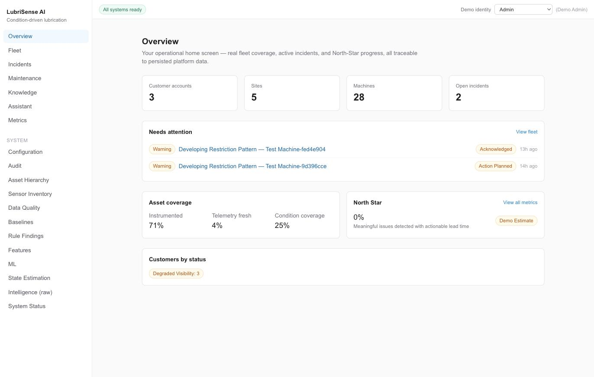
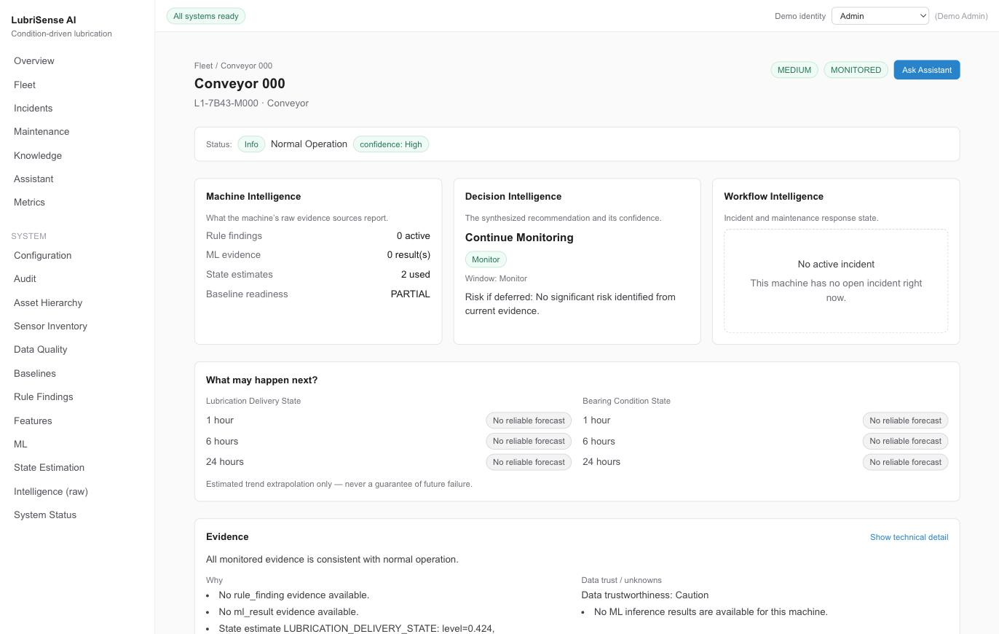
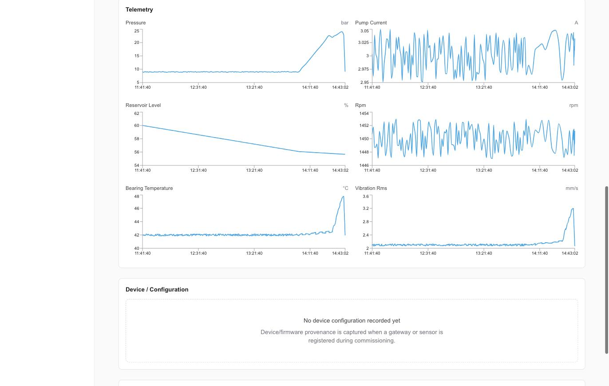
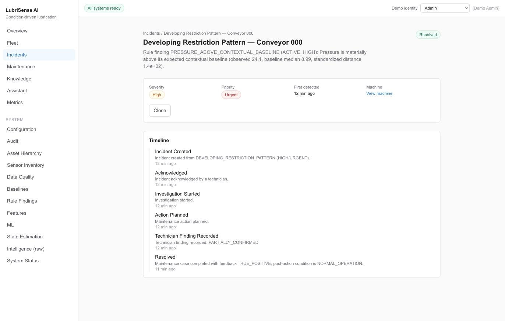
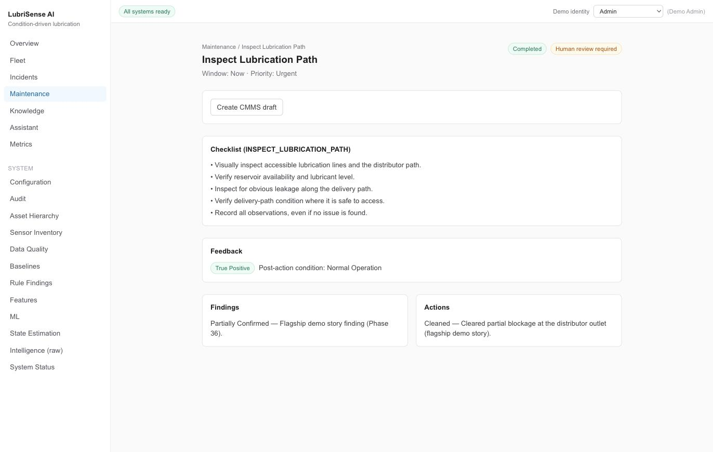

# Demo Guide

This is a walkthrough for showing LubriSense AI to someone who has not seen it before —
a prospect, a reviewer, a colleague. It assumes the platform is already running
(`make up` or `docker compose up -d`) and the demo data has been reset (see below).

Two paths are provided: a **60-90 second** version for a quick look, and a **5-10
minute** version that walks the full story end to end.

Real screenshots from a live run (`docs/screenshots/`), taken against the flagship
machine after a `make demo-reset`:

| | |
|---|---|
|  Overview — fleet coverage, North Star, needs-attention |  Flagship machine — resolved, Normal Operation |
|  Telemetry — the full healthy → deviation → recovery story |  Incident timeline — created through resolved |
|  Maintenance case — checklist, findings, actions, feedback | |

## Before you start

Reset the demo to a known, deterministic state:

```
make demo-reset
```

or, equivalently:

```
./scripts/demo-reset.sh
```

This brings up the platform stack, applies migrations, seeds the base asset hierarchy,
seeds the approved knowledge corpus, and rebuilds the flagship machine's entire story from
scratch. It is safe to run as many times as you like — it only ever touches its own demo
data (see "What is synthetic" below), never a real customer's data.

**Expected flagship machine:** Conveyor 000 (`L1-7B43-M000`), under the `LubriSense Demo
Tenant`.

**Expected outcome after reset:** the flagship machine's incident is `RESOLVED`, its
maintenance case is `COMPLETED` with `TRUE_POSITIVE` feedback, and its current condition
usually reads `NORMAL_OPERATION` — the story has already played out from healthy, through a
detected problem, to a confirmed fix. On a small fraction of runs (roughly 1 in 8; a known,
timing-sensitive limitation — see the Phase 39 addendum on ADR-172 in
`TECHNICAL_DECISIONS.md`) the current-condition re-check lands on `AMBIGUOUS_CONDITION`
instead — the incident is still correctly `RESOLVED` and the maintenance case still
`COMPLETED` with `TRUE_POSITIVE` either way, but if you want the tidiest "reads healthy
again" visual, just run `make demo-reset` once more. The interesting part to show a
reviewer is not "look,
it's broken right now" — it's the machine's *telemetry history and timeline*, which show
the whole detect → diagnose → decide → act → resolve arc even though the machine reads
healthy again by the time you look at it. That is the point: the system caught something,
someone acted on it, and it's provably fixed.

---

## 60-90 second path

1. Open **Fleet** — a real, multi-tenant asset hierarchy (customers → sites → plants →
   lines → machines), not a mock list.
2. Click into **Conveyor 000**. Scroll to the **Telemetry** section and point at the
   Pressure, Bearing Temperature, and Vibration charts: each shows a calm flat baseline,
   a clear rise, and a clear recovery back to baseline — one coherent physical story, not
   random noise.
3. Click the **Active incident** link (or go to **Incidents** and open the most recent
   `Developing Restriction Pattern` one) and show the **Timeline**: created →
   acknowledged → investigated → technician finding → resolved, each with a real evidence
   summary, not placeholder text.
4. That's the pitch: real telemetry, a real evidence-based diagnosis, a real workflow, a
   real confirmed outcome.

---

## Full walkthrough (5-10 minutes)

### 1. Overview

Start at **Overview** (`/overview`). This is the fleet-level summary: connected assets,
active incidents, and the platform's North Star metric framing. Point out that every
number here comes from a real backend query — nothing on this page is hardcoded.

### 2. Fleet

Go to **Fleet** (`/fleet`). Show the asset hierarchy — customer accounts, sites, plants,
production lines, machines — and that it reflects a realistic industrial structure, not a
flat device list. Filter or search to show it's a real, queryable table.

### 3. The flagship machine

Open **Conveyor 000** (`/machines/88551bef-3149-5a8d-9645-bcd9502f4795`). Walk the page
top to bottom:

- **Status strip**: current condition (`Normal Operation`, high confidence — the story has
  already resolved).
- **Three intelligence panels** — Machine Intelligence (raw evidence: rule findings, ML
  results, state estimates, baseline readiness), Decision Intelligence (the synthesized
  recommendation), Workflow Intelligence (incident/maintenance state). Point out these are
  three distinct layers, not one opaque "AI says X" box (see `CLAUDE.md`'s "Machine &
  Sensor Intelligence → Decision Intelligence → Workflow Intelligence" model).

### 4. Pressure / pump / bearing evidence

Scroll to **Telemetry**. This is the visual core of the demo:

- **Pressure** and **Bearing Temperature**/**Vibration RMS** each show: a long calm
  healthy baseline, a clear rise (the developing restriction), and a clear drop back to
  baseline (the confirmed fix) — all real, persisted sensor readings.
- **Reservoir Level** shows a slow, unrelated, independent decline — deliberately *not*
  tied to the main story, so it doesn't get conflated with the restriction.
- **Pump Current** and **RPM** show realistic sensor noise around a stable value —
  intentionally *not* spiking (see `TECHNICAL_DECISIONS.md` ADR-172 for why: this
  topology has no flow sensor, so two independently-voting hydraulic findings at once
  would currently read as an unresolved disagreement rather than corroborating evidence —
  a known, documented limitation, not a bug you need to explain away).

### 5. Condition

Back up to the **status strip** and the **Evidence** panel. Click "Show technical detail"
to reveal the full evidence chain: which rule findings and state estimates contributed,
their severity, and the plain-language "what is happening / why" summary. This is the
Condition Intelligence layer (`docs/CONDITION_INTELLIGENCE.md`).

### 6. Prognosis

The **"What may happen next?"** panel shows a per-state-type, per-horizon forecast
(1h/6h/24h) extrapolated from the state estimator's own trend — or an honest "No reliable
forecast" when there isn't enough signal to extrapolate responsibly. Point out the caveat
text: "Estimated trend extrapolation only — never a guarantee of future failure."

### 7. Recommended action

The **Decision Intelligence** panel: the recommended action, priority, human-review flag,
recommended window, and risk-if-deferred — all derived from the condition assessment, not
a second, independent guess.

### 8. Incident

Click through to the incident (`/incidents/{id}`, or via **Incidents** in the sidebar).
Show the **Timeline**: Incident Created → Acknowledged → Investigation Started → Action
Planned → Technician Finding Recorded → Resolved — a real, chronological, append-only
audit trail, each entry with its own evidence summary and relative timestamp.

### 9. Maintenance workflow

Click through to the maintenance case (`/maintenance/{id}`). Show:

- The **checklist**, generated for the specific recommended action (`Inspect Lubrication
  Path`).
- **Findings** and **Actions**: what the technician recorded during the investigation and
  the physical action taken (cleared a blockage).
- **Feedback**: the technician's classification (`True Positive`) and the *real,
  freshly-recomputed* post-action condition (`Normal Operation`) — proving the fix
  actually worked, not just that someone clicked "done."

### 10. Approved knowledge

Go to **Knowledge** (`/knowledge`). Show the approved document library — inspection
procedures, failure-mode references — each with a lifecycle (`DRAFT → REVIEW → APPROVED →
RETIRED`, see `docs/RAG_KNOWLEDGE_SYSTEM.md`). Only `APPROVED` documents are ever used to
answer questions.

### 11. Assistant with citations

Go to **Assistant** (`/assistant`), or click **Ask Assistant** from the machine page (this
carries the machine/incident context automatically). Ask something like "what should the
technician check for a developing restriction on this machine?" and show that the answer
cites specific approved documents/sections — never a fabricated procedure. If you ask
something outside the approved corpus, show that it says so honestly
("Insufficient approved documentation to answer reliably") rather than guessing.

### 12. Technician finding / feedback

Return to the maintenance case page (step 9) as the closing beat: the loop is complete —
telemetry → detection → diagnosis → decision → incident → human action → confirmed
outcome, all real and all traceable back to the specific evidence that produced it.

---

## What is synthetic

- All telemetry values (pressure, pump current, reservoir level, RPM, bearing temperature,
  vibration) are synthetically generated by `backend/scripts/seed_flagship_story.py` —
  labeled as demo data, never presented as real customer sensor readings (`CLAUDE.md`:
  "Synthetic ranges must be explicitly labelled as demo assumptions").
- The specific failure narrative (a developing distributor-outlet restriction) is a
  scripted scenario, not observed on real equipment.
- The asset hierarchy (`backend/scripts/seed_demo_data.py`) is a fictional but
  realistically-shaped multi-tenant customer/site/plant/line/machine structure.
- The approved knowledge corpus (`backend/app/knowledge/corpus/documents.py`) is
  synthetic reference documentation, not a real OEM manual.
- Any ROI/business-value figures shown elsewhere in the product (Metrics page) are
  explicitly labeled `DEMO / ESTIMATED VALUE`, never presented as proven customer savings.

## What is genuinely implemented (not mocked)

- Every number and evidence item shown in this walkthrough is computed by a real backend
  service (rules engine, baseline engine, state estimator, condition/decision engines,
  incident/maintenance services, RAG retrieval) reading real, persisted database rows —
  never a hardcoded frontend value (`CLAUDE.md`'s production engineering rules).
- The rule-finding → condition → decision → incident → maintenance → feedback chain is the
  platform's real, tested lifecycle logic; the demo script only supplies the initial
  telemetry input, exactly the way a real sensor gateway would.
- The technician workflow (finding, action, feedback, post-action re-check) runs the same
  `MaintenanceService`/`IncidentService` code paths a real technician's clicks would
  trigger.
- Two ML models exist in the registry (`docs/MODEL_CARD.md`) but neither has cleared its
  promotion gate yet — the platform honestly reports `0 ML result(s)` rather than fabricating
  a confident-sounding score. This is itself a demonstration of the platform's discipline
  around not overclaiming.
- One known, documented limitation is deliberately visible in this demo rather than hidden:
  a narrow condition-intelligence synthesis gap (ADR-172 in `TECHNICAL_DECISIONS.md`) that
  the flagship story's telemetry is shaped to avoid triggering. It is tracked for Phase 39's
  final production-readiness review, not silently ignored.
