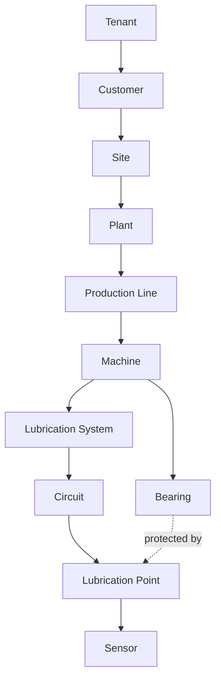

# LubriSense AI — Domain Model

Status: PHASE 0 — DRAFT FOR ACCEPTANCE
Last updated: 2026-08-17

This document defines the people who use LubriSense AI, the physical lubrication-system model it
observes, the industrial asset hierarchy that gives every measurement context, and the core
domain entities that appear throughout the backend, telemetry, and workflow layers.

---

## 1. Personas

Each persona is defined by primary goal, key questions, primary surfaces used, and what a "good
day" looks like for them. Personas drive API design, RBAC scoping, and UX priority — see
`docs/ARCHITECTURE.md` §9 for how roles map to authorization.

### 1.1 Maintenance Technician

- **Goal**: Resolve assigned maintenance work quickly and correctly.
- **Key questions**: What do I need to inspect right now? What's the evidence? What's the
  procedure? What do I record when I'm done?
- **Primary surfaces**: Incident queue, work order detail, guided checklist, finding/action
  capture.
- **Good day**: Every incident assigned to them has enough evidence and procedure attached that
  they can walk up to the machine already knowing what to check.
- **Constraints**: Field-usable (tablet/mobile-friendly), works with intermittent connectivity,
  never requires them to interpret raw sensor data or ML output directly — only conclusions and
  evidence in plain language.

### 1.2 Reliability Engineer

- **Goal**: Understand fleet-wide condition trends and prevent recurring failure modes.
- **Key questions**: Which assets are degrading? Is this a one-off or a pattern across similar
  machines? Are our rules/models catching real problems? What's our lubrication-related failure
  rate trending toward?
- **Primary surfaces**: Fleet condition views, trend/prognostics views, failure-mode analytics,
  incident history, model/rule performance.
- **Good day**: Catches a systemic issue (e.g., a batch of pumps degrading early) before it
  becomes multiple incidents.

### 1.3 Plant Manager

- **Goal**: Ensure the maintenance program protects uptime and is cost-effective.
- **Key questions**: What is my unplanned downtime exposure? Is the team responding to alerts?
  What is this system saving/costing me?
- **Primary surfaces**: Plant-level business/value dashboards, incident summary, ROI/estimated
  value reporting (clearly labeled demo/estimated).
- **Good day**: A monthly review that clearly shows avoided interventions and improving trends,
  without needing to interpret engineering detail.

### 1.4 Service Engineer

- **Goal**: Keep the monitoring system itself (sensors, edge gateways, connectivity, data
  quality) healthy, since bad monitoring data undermines everything downstream.
- **Key questions**: Which sensors/gateways are offline, degraded, or drifting? Is telemetry
  arriving on schedule? Are there data-quality issues masking real conditions?
- **Primary surfaces**: Fleet health/data-quality views, sensor/gateway status, edge diagnostics.
- **Good day**: Catches a sensor dropout or gateway going offline before it silently disables
  monitoring for a machine.

### 1.5 Data Scientist

- **Goal**: Improve the accuracy and trustworthiness of rules, ML models, and state estimation
  over time.
- **Key questions**: What's our false-positive/false-negative rate? Where is technician feedback
  disagreeing with model output? Is a model or rule version underperforming?
- **Primary surfaces**: Model/rule performance views, feature pipelines, labeled feedback
  (technician outcomes), model registry/versioning.
- **Good day**: Has clean, labeled, traceable data (telemetry → feature → prediction → technician
  outcome) to evaluate and improve models responsibly, without being allowed to silently push an
  unvalidated model to production.

### 1.6 Product Manager

- **Goal**: Ensure the product delivers measurable customer and business value and prioritize
  what to build next.
- **Key questions**: What's our useful-alert rate? Warning lead time? Technician action rate?
  Attach rate? Where's the friction in adoption?
- **Primary surfaces**: Business/product metrics, customer usage analytics, feature adoption.
- **Good day**: Has trustworthy, backend-computed metrics (not vanity dashboard numbers) to make
  roadmap and go-to-market decisions.

### 1.7 Administrator

- **Goal**: Ensure the platform is correctly and safely configured for their organization.
- **Key questions**: Are tenants/customers/sites correctly isolated? Are roles and permissions
  correct? Are integrations (CMMS, SSO) configured and healthy? Is the audit trail complete?
- **Primary surfaces**: Tenant/user/role management, integration configuration, audit log,
  system health.
- **Good day**: No cross-tenant data leakage, no orphaned assets, a clean audit trail, and
  integrations that fail safely and visibly rather than silently.

---

## 2. Physical Lubrication-System Model

LubriSense AI's reference implementation models a **centralized (automatic) lubrication system**
of the kind widely used to protect bearings on rotating industrial equipment.

### 2.1 Component Chain

| Component | Role | Example monitored signals (demo) |
|---|---|---|
| **Reservoir** | Holds the lubricant supply (grease or oil) that feeds the pump. | reservoir level, lubricant temperature |
| **Pump** | Draws lubricant from the reservoir and pressurizes it into the line on a controller-driven cycle. | pump current, pump runtime, pump status, pressure |
| **Controller** | Governs pump cycling logic (interval, duration, triggers), reports status/fault codes. | controller state, fault codes, cycle count |
| **Main Lubrication Line** | Carries pressurized lubricant from the pump to the distributor(s). | line pressure, lubricant flow |
| **Distributor** | Splits metered lubricant into multiple circuits, typically via piston-based metering elements. | distributor/piston movement, cycle completion |
| **Circuit** | A sub-branch of the distributor feeding one or more lubrication points. | flow/cycle completion per circuit |
| **Lubrication Point** | The physical delivery point where lubricant reaches a bearing. | delivery confirmation, local pressure (where instrumented) |
| **Bearing** | The rotating-machine component being protected. | bearing temperature, vibration RMS, vibration peak |
| **Machine** | The asset (conveyor, motor, fan, pump, compressor, crusher, etc.) that the bearing supports. | RPM, load, runtime, machine state |

### 2.2 Signal Categories

**Lubrication-system signals** (health of the delivery system itself):
reservoir level, pressure, lubricant flow, pump current, pump runtime, pump status,
lubrication-cycle completion, distributor/piston movement, lubricant temperature, controller
state, fault codes.

**Machine-condition signals** (health of the protected asset, only partially caused by
lubrication):
vibration RMS, vibration peak, bearing temperature, RPM, load, runtime, machine state.

This distinction matters for diagnosis: a bearing problem may be *caused by* a lubrication-system
fault (e.g., gradual restriction starving a bearing) or may be *independent of* lubrication (e.g.,
misalignment, imbalance, fatigue) — see `docs/FAILURE_MODE_CATALOG.md` §11 for the failure mode
that explicitly represents the independent case, and §12 for causal-language rules.

### 2.3 Engineering Values Disclaimer

**All numeric ranges, thresholds, and failure signatures used anywhere in this reference
implementation (rules, simulator, ML labels, documentation) are synthetic demo assumptions
created for this project.** They are not proprietary industrial specifications, not derived from
any proprietary industrial manufacturer's data, and must never be presented as validated
industrial thresholds. Every place a threshold is
used, it must be configurable and clearly traceable to a "demo assumption" source, not hardcoded
as if it were an authoritative engineering constant. See `TECHNICAL_DECISIONS.md` ADR-001.

---

## 3. Industrial Asset Hierarchy

Every telemetry record, model output, incident, work order, and maintenance event must resolve to
a full asset context. Reasoning from anonymous sensor IDs is not permitted (`TECHNICAL_DECISIONS.md`
ADR-010).

| Level | Description |
|---|---|
| **Tenant** | Top-level isolation boundary. Typically one tenant per deploying organization (e.g., a service provider operating LubriSense AI for multiple customers), or one tenant per enterprise customer in a single-tenant deployment model. All data, users, and configuration are strictly scoped to a tenant. |
| **Customer** | The business entity that owns/operates the monitored assets within a tenant (relevant when one tenant hosts multiple customers, e.g., an OEM or service provider model). |
| **Site** | A physical location (a factory, plant campus, or facility address). |
| **Plant** | A production facility or major operational unit within a site. |
| **Production Line** | A logical grouping of machines that make up a production process/line. |
| **Machine** | A physical rotating asset: conveyor, motor, fan, pump, compressor, crusher, etc. |
| **Bearing** | A specific bearing position on a machine (e.g., "drive-end bearing", "non-drive-end bearing"). |
| **Lubrication System** | The centralized lubrication system instance serving one or more bearings/machines. |
| **Circuit** | A branch of a lubrication system's distributor serving a subset of lubrication points. |
| **Lubrication Point** | The specific delivery point for one bearing (or shared point, where applicable). |
| **Sensor** | A physical or virtual measurement device attached at some level of this hierarchy (reservoir, pump, line, bearing, machine). |

**Note on cardinality**: a Machine has one or more Bearings; a Bearing is protected by one (or
occasionally more) Lubrication Point; a Lubrication System serves one or more Circuits, each
serving one or more Lubrication Points, which may span multiple Machines within a Production
Line. The relationship between the *lubrication chain* (§2.1) and the *asset hierarchy* (§3) is:
the lubrication chain is the physical plumbing; the asset hierarchy is the organizational/data
context that chain is deployed within.

### 3.1 Tenancy Rules

- No entity may reference another entity in a different tenant.
- No orphaned assets: every Bearing, Lubrication System, Circuit, Lubrication Point, and Sensor
  must resolve to a Machine and, transitively, to a Tenant.
- No duplicate sensor registration within the same lubrication point/measurement type.

---

## 4. Core Domain Entities (Non-Physical)

Beyond the physical asset hierarchy, the following domain entities recur across
`docs/EVENT_CATALOG.md`, `docs/ARCHITECTURE.md`, and future implementation phases:

| Entity | Purpose |
|---|---|
| **TelemetryReading** | A single timestamped measurement from a sensor, scoped to its asset context. |
| **Baseline** | Learned or configured "normal" range for a signal on a specific asset, used by rules/ML. |
| **ConditionAssessment** | Structured output of Machine & Sensor Intelligence: condition, status, severity, confidence, trend, evidence, uncertainty, data_quality, rule_version, model_version. |
| **Decision** | Structured output of Decision Intelligence: recommended action, priority, recommended window, risk if deferred, human_review_required, evidence, confidence. |
| **Incident** | A tracked maintenance-relevant event, correlated from one or more conditions/decisions, with a lifecycle (see `docs/EVENT_CATALOG.md` §5). |
| **WorkOrder** | A unit of maintenance work, drafted from an incident, tracked through inspection to resolution. |
| **Finding** | A technician-recorded observation made during inspection. |
| **Action** | A technician-recorded maintenance action taken. |
| **Outcome** | The final technician-assessed classification of an incident: TRUE_POSITIVE, FALSE_POSITIVE, MISSED_FAILURE, INCONCLUSIVE. |
| **KnowledgeDocument** | A maintenance/engineering document usable by RAG, with lifecycle DRAFT → REVIEW → APPROVED → RETIRED. |
| **ModelArtifact** | A versioned ML model or rule-set version, tracked for governance and reproducibility. |

These entities are elaborated with fields and transitions in `docs/EVENT_CATALOG.md` and will be
formally schema'd in Phase 2 (Domain Model + Asset Hierarchy implementation).
