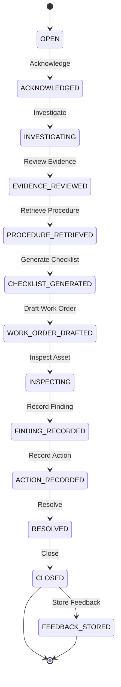
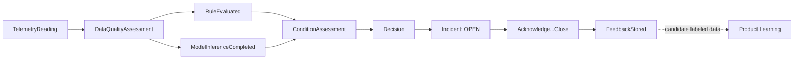

# LubriSense AI — Event Catalog

Status: PHASE 0 — DRAFT FOR ACCEPTANCE
Last updated: 2026-08-17

This document defines the telemetry and event model that flows through the architecture
described in `docs/ARCHITECTURE.md` §1 and §6: raw telemetry events, the structured
`ConditionAssessment` and `Decision` contracts that separate the three intelligence layers, the
incident lifecycle, the maintenance-workflow event chain, and how the North Star metric is
computed from this event history.

Field lists in this document are illustrative of shape and intent for Phase 0 architectural
review. Authoritative schemas (types, constraints, migrations) are defined during
implementation (Phase 2 Domain Model, Phase 6 Telemetry Pipeline).

---

## 1. Event Design Principles

- **Append-only telemetry**: raw readings are never mutated in place; corrections are new events
  with provenance.
- **Asset-scoped**: every event carries full asset-hierarchy context (or a resolvable reference
  to it), per `docs/DOMAIN_MODEL.md` §3.
- **Versioned schemas**: every event type carries a schema version so consumers can evolve
  independently.
- **Provenance-tagged**: every event records its source (`synthetic`, `edge-real`, `manual`,
  `system`) so synthetic and real data are never ambiguous.
- **Idempotent ingestion**: duplicate telemetry (retries, at-least-once delivery) must be
  detectable and deduplicated, never double-counted.
- **Time discipline**: events carry both `device_time` (when the measurement was taken, if
  known) and `ingested_time` (when the platform received it), since these can diverge under
  buffering/store-and-forward.

---

## 2. Telemetry Events

### 2.1 `TelemetryReading`

Implemented in Phase 6 as the `telemetry` TimescaleDB hypertable, fed by
`edge.domain.envelope.ReadingEnvelope` (Phase 5) via the MQTT → Kafka → consumer pipeline
(`docs/TELEMETRY_PIPELINE.md`) — this table supersedes the Phase 0 placeholder field list
below it, reconciling naming (`reading_id` → `event_id`, `signal_type` →
`measurement_type`, `device_time`/`ingested_time` → the real three-plus-four timestamp
model) with what the edge and central pipeline actually built.

| Field | Description |
|---|---|
| `event_id` | Deterministic `uuid5(gateway_id, sensor_id, sequence_number)`, minted once at edge acquisition, never regenerated on retry/replay/redelivery — the idempotency key (with `source_timestamp`) at every hop. |
| `schema_version` | Wire-contract schema version; unsupported major versions are rejected, not silently parsed (`docs/TELEMETRY_PIPELINE.md` §6). |
| `correlation_id` | Cross-service trace correlation. |
| `tenant_id`, `site_id`, `plant_id`, `production_line_id`, `machine_id`, `bearing_id`, `lubrication_system_id`, `circuit_id`, `lubrication_point_id`, `sensor_id` | Full asset-hierarchy context. Only `tenant_id`/`machine_id`/`sensor_id` are edge-supplied; the rest are filled in by central context enrichment from the authoritative Phase 2 hierarchy (`docs/TELEMETRY_PIPELINE.md` §9) — never guessed by the edge. |
| `measurement_type` | One of the 13 `docs/DOMAIN_MODEL.md` §2.2 measurement types (`PRESSURE`, `FLOW`, `RESERVOIR_LEVEL`, `PUMP_CURRENT`, `PUMP_RUNTIME`, `CYCLE_COMPLETION`, `PISTON_MOVEMENT`, `LUBRICANT_TEMPERATURE`, `VIBRATION_RMS`, `VIBRATION_PEAK`, `BEARING_TEMPERATURE`, `RPM`, `LOAD`). |
| `value` | Numeric reading; nullable (a withheld observation during sensor dropout/network failure is never a fabricated `0.0` — see `docs/SYNTHETIC_DATA_MODEL.md`). |
| `unit` | Unit of measure. |
| `quality` | `GOOD` \| `UNCERTAIN` \| `SUSPECT` \| `MISSING` \| `INVALID` \| `COMMUNICATION_LOSS` \| `BAD` \| `UNAVAILABLE`. |
| `operating_state` | Machine operating-profile state at acquisition time. |
| `source_timestamp` | The original device/simulation time — never overwritten anywhere downstream; the hypertable's partitioning column. |
| `edge_received_timestamp`, `edge_emitted_timestamp` | When the edge acquired vs. published the reading. |
| `mqtt_received_timestamp`, `kafka_published_timestamp`, `consumer_received_timestamp`, `persisted_timestamp` | Central-pipeline-only arrival timestamps, added separately from (never merged into) the edge's own envelope — see `docs/TELEMETRY_PIPELINE.md` §5. |
| `sequence_number` | Per-(gateway, sensor) monotonic counter, preserved exactly; out-of-order arrival is persistable, not corrected. |
| `gateway_id`, `device_id`, `firmware_version`, `controller_version` | Source device identity. `gateway_id` is emitted by the edge as `Gateway.id` (a UUID, despite the field name); central enrichment resolves it against `Gateway.id` first, falling back to `Gateway.gateway_code`, not FK-enforced in the `telemetry` table itself. |
| `source` | `synthetic` \| `edge-real` \| `manual`. |
| `metadata` | Free-form JSONB extension point. |

Malformed or unresolvable events never reach this table — they land in
`telemetry_quarantine` instead (`docs/TELEMETRY_PIPELINE.md` §12).

### 2.2 `DataQualityAssessment`

Produced by the Data Quality stage (`docs/ARCHITECTURE.md` §1) per sensor/signal window.

| Field | Description |
|---|---|
| `sensor_id`, asset context | As above. |
| `window_start`, `window_end` | Evaluation window. |
| `completeness` | Share of expected readings received. |
| `staleness` | Time since last reading. |
| `plausibility` | Whether values fall within physically plausible bounds. |
| `data_quality_score` | Composite score consumed by rules/ML/Condition Intelligence. |
| `flags` | e.g. `STALE`, `DROPOUT`, `OUT_OF_RANGE`, `DRIFT_SUSPECTED` (see `docs/FAILURE_MODE_CATALOG.md` §8–9). |

### 2.3 Edge/Gateway Health Events

Implemented in Phase 5 as `edge.health.snapshot.EdgeHealth` (queried on demand via
`python -m edge status`, not yet pushed as its own MQTT event — see
`docs/EDGE_ARCHITECTURE.md` §14) rather than as three separate wire events; the field lists
below reflect what that snapshot actually carries, superseding the earlier placeholder
purpose-only table.

| Event (conceptual) | Purpose | Concrete fields (Phase 5) |
|---|---|---|
| `EdgeHeartbeat` | Periodic liveness signal from an edge controller. | `runtime_status`, `gateway_id`, `connected_sensor_count`, `last_acquisition_time`, `firmware_version`, `config_version`. |
| `EdgeBufferStatus` | Reports store-and-forward buffer depth/age during connectivity loss. | `buffer_depth` (PENDING count), `oldest_buffered_event_age_seconds`, `connectivity_state` (`ONLINE`/`DEGRADED`/`OFFLINE`/`RECOVERING`), `last_transport_success`, metrics (`acquired`, `buffered`, `sent`, `replayed`, `failures`, `duplicates_prevented`, `buffer_overflow_count`). |
| `GatewayFaultRaised` / `GatewayFaultCleared` | Local deterministic alarm state changes. | See §4.1 — implemented as `LocalEdgeAlert`, not a gateway-level fault type; `open_local_alert_count` is included in the health snapshot above. |

---

## 3. Condition & Decision Events

These formalize the Machine & Sensor Intelligence → Decision Intelligence boundary
(`docs/ARCHITECTURE.md` §4, §8).

### 3.1 `BaselineUpdated`

| Field | Description |
|---|---|
| Asset/signal context | As above. |
| `baseline_value` / `baseline_range` | Learned or configured normal range. |
| `method` | e.g. `rolling_statistics`, `configured_demo_assumption`. |
| `effective_from` | When this baseline becomes active. |

### 3.2 `RuleEvaluated` / `ModelInferenceCompleted`

| Field | Description |
|---|---|
| `rule_version` / `model_version` | Traceability for governance. |
| Asset/signal context | As above. |
| `result` | Rule outcome or model output (e.g., anomaly score, class probability, forecasted depletion date). |
| `input_window` | Time window / feature snapshot used. |

### 3.3 `ConditionAssessment` (Machine & Sensor Intelligence output)

| Field | Description |
|---|---|
| `condition` | e.g. `NORMAL`, `GRADUAL_RESTRICTION`, `SUDDEN_BLOCKAGE`, etc. — see `docs/FAILURE_MODE_CATALOG.md`. |
| `status` | e.g. `ACTIVE`, `RESOLVED`, `SUPERSEDED`. |
| `severity` | e.g. `INFO`, `WARNING`, `CRITICAL`. |
| `confidence` | Numeric confidence in the assessment. |
| `trend` | e.g. `IMPROVING`, `STABLE`, `WORSENING`. |
| `evidence` | Structured list of contributing rule/ML/state-estimation outputs. |
| `uncertainty` | Explicit uncertainty representation (e.g., prediction interval, class-probability spread). |
| `data_quality` | Reference to the relevant `DataQualityAssessment`. |
| `rule_version`, `model_version` | Traceability. |
| Asset context | Full hierarchy reference. |

### 3.4 `Decision` (Decision Intelligence output)

| Field | Description |
|---|---|
| `recommended_action` | e.g. "Inspect lubrication point for restriction," "Schedule reservoir refill." |
| `priority` | e.g. `LOW`, `MEDIUM`, `HIGH`, `URGENT`. |
| `recommended_window` | Suggested timeframe to act. |
| `risk_if_deferred` | Qualitative/quantitative risk statement. |
| `human_review_required` | Boolean — always `true` for critical/operational-adjacent recommendations. |
| `evidence` | References the source `ConditionAssessment`(s). |
| `confidence` | Numeric confidence. |
| Asset context, asset criticality, maintenance history references | Decision context beyond raw condition. |

---

## 4. Alerting & Incident Lifecycle

### 4.1 `LocalAlarmRaised` / `LocalAlarmCleared` (Edge)

Deterministic, edge-local alarms that do not depend on cloud connectivity
(`docs/ARCHITECTURE.md` §5). Implemented in Phase 5 as `edge.domain.alert.LocalEdgeAlert`
(`edge/edge/rules/engine.py`), produced by exactly four deterministic checks — see
`docs/EDGE_ARCHITECTURE.md` §10. Fields: `alert_id`, `timestamp`, `tenant_id`, `gateway_id`,
`machine_id`, `component_id`, `sensor_id` (all context fields optional — populated when
resolvable), `rule_id` (`LOCAL_RANGE_VIOLATION` / `LOCAL_WARNING` /
`LOCAL_LUBRICATION_CYCLE_FAILURE` / `LOCAL_SENSOR_FAULT`), `severity`
(`INFO`/`WARNING`/`CRITICAL`), `message`, `evidence` (rule-specific structured data),
`source_event_ids` (the `ReadingEnvelope.event_id`(s) that triggered it), `status`
(`OPEN`/`CLEARED` — a raise/clear transition, not one alert per tick). Structurally separate
from `ConditionAssessment` (§3.3) — Phase 5 does not diagnose, it only flags a deterministic
local condition.

### 4.2 `Incident`

Correlates one or more `Decision`/`ConditionAssessment` events into a trackable unit of work.



| Field | Description |
|---|---|
| `incident_id` | Unique identifier. |
| Asset context | Full hierarchy reference. |
| `state` | Current lifecycle state (diagram above). |
| `severity`, `priority` | Carried/derived from the triggering `Decision`. |
| `source_decisions` | References to contributing `Decision` events. |
| `assigned_to` | Technician/role assignment. |
| `opened_at`, `acknowledged_at`, ... `closed_at` | Timestamps per transition. |
| `state_history` | Full audit trail of transitions with actor and timestamp. |

### 4.3 Workflow Sub-Events

| Event | Produced during | Layer |
|---|---|---|
| `IncidentAcknowledged` | Acknowledge | Workflow |
| `InvestigationStarted` | Investigate | Workflow |
| `EvidenceReviewed` | Review Evidence | Workflow (human reviewing Decision Intelligence output) |
| `ProcedureRetrieved` | Retrieve Procedure | Workflow Intelligence (RAG) |
| `ChecklistGenerated` | Generate Checklist | Workflow Intelligence (RAG/guarded agent) |
| `WorkOrderDrafted` | Draft Work Order | Workflow Intelligence (guarded agent; draft only, human must approve/dispatch) |
| `AssetInspected` | Inspect Asset | Workflow (human, field) |
| `FindingRecorded` | Record Finding | Workflow (human) |
| `ActionRecorded` | Record Action | Workflow (human) |
| `IncidentResolved` | Resolve | Workflow |
| `IncidentClosed` | Close | Workflow |
| `FeedbackStored` | Store Feedback | Workflow → Product Learning boundary |

### 4.4 `FeedbackStored` / Outcome

| Field | Description |
|---|---|
| `incident_id` | Reference. |
| `outcome` | `TRUE_POSITIVE` \| `FALSE_POSITIVE` \| `MISSED_FAILURE` \| `INCONCLUSIVE`. |
| `technician_notes` | Free text. |
| `recorded_by` | Technician/role. |
| `recorded_at` | Timestamp. |

Per `TECHNICAL_DECISIONS.md` ADR-009, `FeedbackStored` events are candidate future training data
only — they do not automatically retrain or promote a production model.

---

## 5. Event Flow Summary



This mirrors `docs/ARCHITECTURE.md` §1's end-to-end chain at the event level: each stage of the
architecture corresponds to one or more event types defined here.

---

## 6. North Star Metric Computation (Illustrative)

From `docs/PRODUCT_VISION.md` §7 / `docs/ARCHITECTURE.md` §12.3:

> Percentage of meaningful lubrication issues detected with actionable lead time.

Computed as:

```
numerator   = count(Incident where outcome = TRUE_POSITIVE
                     and (predicted_onset_time - decision.created_at) >= configured_lead_time_threshold)
denominator = count(Incident where outcome in [TRUE_POSITIVE, MISSED_FAILURE])
```

`FALSE_POSITIVE` and `INCONCLUSIVE` outcomes are excluded from the denominator because they are
not "meaningful lubrication issues." `configured_lead_time_threshold` is a per-deployment
configuration value, not a hardcoded constant — consistent with the demo-assumption labeling
policy in `docs/DOMAIN_MODEL.md` §2.3. Supporting metrics (false-alert rate, warning lead time,
technician confirmation/action rate) are derived from the same event stream and are defined in
`docs/ARCHITECTURE.md` §12.
