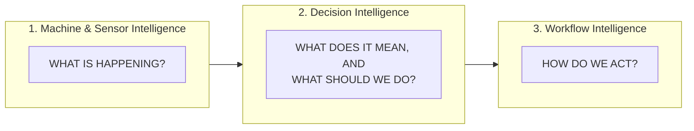

# LubriSense AI — Product Vision

Status: PHASE 0 — DRAFT FOR ACCEPTANCE
Owner: Product / Architecture
Last updated: 2026-08-17

---

## 1. The Problem

Centralized and automatic lubrication systems exist on the vast majority of rotating industrial
equipment — conveyors, motors, fans, pumps, compressors, crushers — because bearings that are
under-lubricated, over-lubricated, or lubricated with contaminated/degraded grease fail early,
and bearing failure is one of the most common causes of unplanned downtime in heavy industry.

Despite this, lubrication systems today are largely **invisible until they fail**:

- Reservoir levels, pump cycles, line pressure, and distributor behavior are either not
  monitored at all, or are monitored locally on a controller display that nobody is watching.
- Technicians discover problems reactively: a dry bearing overheats, a line ruptures and sprays
  grease across a floor, a machine trips on vibration, or a scheduled inspection happens to catch
  a fault days or weeks after it started.
- Maintenance teams have no reliable way to distinguish "this needs attention this week" from
  "this needs attention right now," so alerts — where they exist at all — are either ignored
  (too noisy) or arrive too late (too rare, poorly tuned, or entirely threshold-based with no
  context).
- Even when a problem is correctly detected, turning "sensor reading is abnormal" into "here is
  the specific action a technician should take, on this specific asset, today" is a manual,
  tribal-knowledge-dependent process that does not scale across a fleet of hundreds or thousands
  of machines.
- The resulting maintenance loop — inspect, diagnose, decide, act, record, learn — is fragmented
  across paper checklists, spreadsheets, radio calls, and disconnected CMMS tickets. Evidence
  gathered in the field rarely makes it back into the system that raised the alert, so alerting
  logic never improves.

None of this is a data-visualization problem. Plants do not lack screens. They lack a system that
turns physical signals into a trustworthy, explainable, timely maintenance decision — and then
closes the loop by learning from what technicians actually find.

## 2. Product Vision

> **LubriSense AI turns raw lubrication and machine-condition telemetry into maintenance
> decisions technicians can trust, delivered early enough to act on, with the evidence and
> workflow needed to act quickly — and it gets better every time a technician closes the loop.**

LubriSense AI is a condition-driven intelligent lubrication platform. It observes the physical
state of centralized lubrication systems and the bearings/machines they protect, reasons about
what that state means using a combination of deterministic engineering rules, machine learning,
and state estimation, and helps maintenance and reliability teams act on that reasoning through
guided workflows grounded in approved documentation.

It is built end-to-end, from a simulated physical asset through edge processing, streaming
telemetry, a real backend domain model, real condition/decision logic, and a real maintenance
workflow — not a UI wrapped around static data.

### 2.1 Core Product Principle

**AI is not the product.**

The product is:

> A BETTER MAINTENANCE DECISION
> MADE EARLIER
> WITH MORE CONFIDENCE
> WITH LESS MANUAL EFFORT.

Every capability in LubriSense AI should be justifiable against that sentence. If a feature does
not make a maintenance decision better, earlier, more confident, or cheaper to reach, it does not
belong in the product's core value proposition — it is, at best, supporting infrastructure.

### 2.2 Product Story

The application must communicate a complete narrative, not a snapshot:

```
DATA → DETECTION → DIAGNOSIS → DECISION → ACTION → OUTCOME → LEARNING
```

It must never be reducible to:

```
CHART → AI MESSAGE
```

A user opening LubriSense AI should be able to trace, for any asset, "what happened, what we
think it means, what we recommended, what the technician did, and what we learned" — not just
look at a live number.

### 2.3 What This Product Is Not

- Not a dashboard-only project. Dashboards visualize; LubriSense AI decides and drives workflow.
- Not a portfolio mockup or hackathon demo. It is a reference implementation for a real
  commercial product category (industrial condition monitoring + intelligent maintenance
  workflow).
- Not an AI chatbot with fake sensor data behind it.
- Not a frontend backed by hardcoded JSON.
- Not an LLM pretending to perform machine diagnostics. Physical diagnosis is the job of rules,
  ML, and state estimation — GenAI explains, retrieves, and drafts, it does not diagnose.

## 3. Who This Is For

LubriSense AI serves the people and roles involved in keeping rotating industrial equipment
running reliably, plus the people who build, sell, and operate the product itself. See
`docs/DOMAIN_MODEL.md` for the full persona definitions; a summary:

| Persona | Primary Question |
|---|---|
| Maintenance Technician | "What do I need to go do, right now, on this machine?" |
| Reliability Engineer | "Which assets are trending toward failure, and why?" |
| Plant Manager | "Is my plant's maintenance program working, and what is it costing/saving me?" |
| Service Engineer | "Is the monitoring system itself healthy — sensors, edge, connectivity?" |
| Data Scientist | "Are the models and rules performing well, and where do they need improvement?" |
| Product Manager | "Is the product delivering value, and where should we invest next?" |
| Administrator | "Is the platform correctly configured, secured, and scoped to the right tenants/assets?" |

## 4. The Three Intelligence Layers

LubriSense AI is organized around three explicit, separately governed intelligence layers. This
separation is the single most important architectural idea in the product — see
`docs/ARCHITECTURE.md` §4 for the full technical treatment and `TECHNICAL_DECISIONS.md` ADR-002.



1. **Machine & Sensor Intelligence** — understands the physical state of the equipment: telemetry
   monitoring, sensor data quality, asset baselines, anomaly detection, failure-mode
   classification, refill forecasting, pump degradation detection, state estimation, trend
   analysis. Answers: *what is happening?*

2. **Decision Intelligence** — translates technical evidence into a maintenance decision by
   combining deterministic rules, ML predictions, state estimates, asset context, operating
   context, data quality, and maintenance history. Produces condition, severity, confidence,
   evidence, recommended action, urgency, and risk-if-deferred. Answers: *what does it mean, and
   what should we do?*

3. **Workflow Intelligence** — turns a diagnosis into a useful maintenance action using GenAI,
   RAG over approved documentation, historical incident retrieval, checklist generation, and
   guarded work-order drafting. It explains and assists; it never operates equipment. Answers:
   *how do we act?*

A feature belongs to exactly one layer. A layer must be able to degrade or fail without silently
disabling the layers beneath it (see `docs/ARCHITECTURE.md` §7, Graceful Degradation).

## 5. Product Scope for This Reference Implementation

LubriSense AI models a **centralized lubrication system** protecting bearings on rotating
industrial machines, using the physical model and asset hierarchy defined in
`docs/DOMAIN_MODEL.md`. Telemetry is synthetic and simulator-driven (see
`docs/ARCHITECTURE.md` §10 and `TECHNICAL_DECISIONS.md` ADR-001) but the platform, data model,
event architecture, intelligence layers, and workflow are built to production-reference
standards, with clear seams where real industrial integrations would replace synthetic
components.

## 6. Customer & Business Value

LubriSense AI is designed as a connected industrial product, not just an analytics feature.
Its value model (elaborated in `docs/ARCHITECTURE.md` §12) includes:

- **Operational value to the customer**: fewer emergency interventions, earlier warning before
  failure, reduced manual inspection effort, better-informed refill and maintenance planning,
  reduced unplanned downtime exposure.
- **Product/business value to the vendor**: connected assets, useful-alert rate, warning lead
  time, technician action rate, deployment effort, support burden, customer expansion, attach
  rate, feature adoption.

All simulated or estimated value figures in this reference implementation are explicitly labeled
`DEMO / ESTIMATED VALUE` and must never be presented as proven customer savings.

## 7. North Star Metric

> **Percentage of meaningful lubrication issues detected with actionable lead time.**

Supporting metrics: false-alert rate, warning lead time, technician confirmation rate, technician
action rate, customer outcome. This metric is configurable per deployment, not hardcoded to one
threshold definition — see `docs/EVENT_CATALOG.md` §6 for how it is computed from event history.

## 8. Guiding Constraints

- AI must never directly control machinery, override a PLC, or change a lubrication parameter.
  Human approval is mandatory for every operational action. (See `docs/ARCHITECTURE.md` §9.)
- Edge deterministic monitoring must continue if the cloud, ML, or GenAI layers are unavailable.
- Deterministic rules are preferred wherever the physics of the problem is well understood; ML is
  used where patterns are multivariable or thresholds alone create excessive false positives;
  GenAI is used only for knowledge, explanation, and workflow assistance.
- No synthetic engineering value (thresholds, ranges, failure signatures) may be presented as a
  proprietary industrial specification. All such values are explicitly labeled demo assumptions.
- Every visible production-like value must be traceable to real backend logic — never hardcoded
  in the frontend, never a fabricated ML response, never a fabricated incident lifecycle.

## 9. Definition of Product Success (Reference Implementation)

This reference implementation succeeds if a technically sophisticated industrial reviewer,
inspecting the repository end to end, concludes that LubriSense AI is a credible architecture for
a commercial connected-lubrication product — not a demo dashboard. Concretely, that means the
full chain `SENSOR → SIGNAL → CONDITION → DECISION → ACTION → OUTCOME → LEARNING` is real,
traceable, and testable at every stage, even though the sensors themselves are simulated.
